<!-- GitHub Profile README.md -->

  
  
  
  
  
  
  
  

# Hello, I'm GeekSloth

> PhD candidate and research engineer working from mathematical signal analysis to deployable sensing systems.

I am a PhD Candidate in Computer Science at Khon Kaen University, working across computational imaging, stochastic signal and image processing, medical AI, and sensor-integrated intelligent systems. My research investigates transform-domain analysis, inverse problems, noise and artifact suppression, and real-time edge inference. In the longer term, I am interested in computational sensory substitution: designing structured mappings between high-dimensional perceptual signals to make information more accessible.

---

## Professional practice

### Signal and Image Processing Researcher

I study signal representations and computational imaging with an emphasis on Fourier and transform-domain analysis, stochastic noise modeling, artifact reduction, inverse problems, and optimization-based reconstruction. My applied work includes medical imaging, ECG and multimodal analysis, AI-assisted detection, and classification, with a focus on methods that can move from controlled experiments toward useful sensing systems.

  
  
  
  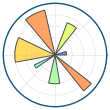
  
  
  
  
  

scikit-image · <code>uv</code> · Virtual Environment · Markdown · IEEE publication workflow · MDPI publication workflow

  
  <a href="https://www.youtube.com/watch?v=z3PGISZgiW0">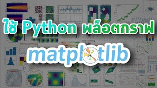</a>
  <a href="https://www.youtube.com/watch?v=4J0Wpf-onjo">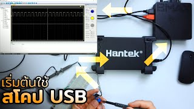</a>

---

### AI and Edge ML Engineer

I design, adapt, and deploy machine-learning systems for computer vision, language, and sensor data. This includes fuzzy logic, YOLO-based detection, LLM and RAG applications, fine-tuning, GPU-accelerated parallel computation, and efficient deployment on NVIDIA Jetson and other edge platforms. I work across experimental training workflows and practical local or containerized inference environments.

  
  
  
  
  
  
  
  
  
  
  
  
  

YOLO · Fuzzy Logic · LLMs · RAG · Fine-tuning · TensorRT · TensorRT for Jetson · NVIDIA JetPack · Parallel Programming · Pi Agent

  <a href="https://www.youtube.com/watch?v=J5u8zVMiO8E">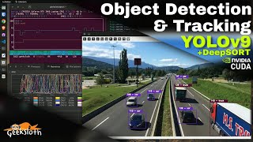</a>
  <a href="https://www.youtube.com/watch?v=gEOy8EPZuKQ">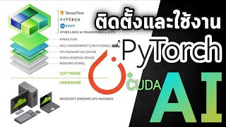</a>
  

---

### Backend and Distributed Systems Developer

I build API-first services and supporting infrastructure for AI applications, real-time systems, and containerized deployments. My backend work spans secure authentication, relational and document data stores, caching, asynchronous messaging, WebSocket communication, reverse proxies, and practical hosting or virtualization environments.

  
  
  

WebSocket · Docker Compose · cPanel

  <a href="https://www.youtube.com/watch?v=Qfv3fxJsK_0">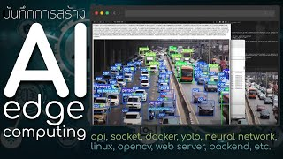</a>
  <a href="https://www.youtube.com/watch?v=5RyUPZGETeg">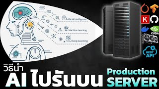</a>
  <a href="https://www.youtube.com/watch?v=BgejaZPU6dA">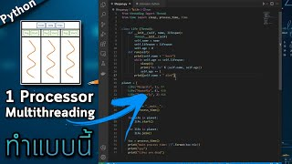</a>

---

### Embedded Systems and Hardware Engineer

I develop sensor-integrated and real-time systems across microcontrollers, single-board computers, industrial control, and edge accelerators. The work combines hardware–software co-design, signal acquisition, deterministic communication, PCB prototyping, and embedded AI, from early prototypes to operational sensing and control systems.

  
  
  
  
  

Ninja · Microcontrollers · Single-board computers · PLC · LoRa · MQTT · CAN · Modbus · RS-485 · Oscilloscope · SiPeed · Hailo · HailoRT · Fritzing · Kivy

  <a href="https://www.youtube.com/watch?v=xxBklDEj95M">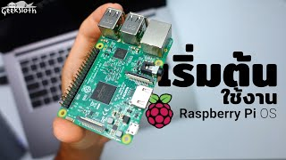</a>
  <a href="https://www.youtube.com/watch?v=LcyshfnrboA">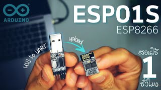</a>
  <a href="https://www.youtube.com/watch?v=k2Xpjv19_mk">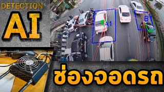</a>

---

### Cyber-Physical Security Researcher

I examine the security and resilience of connected systems through authorized research, isolated lab environments, and protocol-level analysis. My interests include network traffic inspection, secure communication, cryptographic primitives, GPU-assisted computation, and the relationship between embedded devices, distributed infrastructure, and cyber-physical risk.

  
  
  
  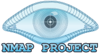

Isolated Lab Environments · TailsOS · SSH Tunnels · tcpdump · hcxdumptool · Hashcat · Threading · Encryption · Decryption · GPU Brute Force · Crypto Analysis

  <a href="https://www.youtube.com/watch?v=Ob8XsIZZwGw">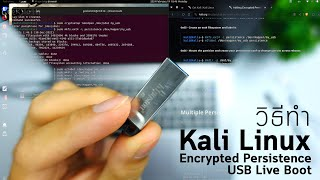</a>
  
  <a href="https://www.youtube.com/watch?v=EcXLVB0F_4M">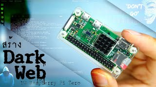</a>

---

### Self-Hosted and Independent Systems

I maintain a small independent infrastructure for private services, remote access, observability, automation, and decentralized-systems experimentation. This space is separate from my security research: it is where I explore practical self-hosting, home automation, personal data services, ad filtering, and Bitcoin or Lightning infrastructure.

  
  
  
  
  
  
  
  

RustDesk · Tmux · Herdr · Bitcoin Node · Lightning Node · Crypto Mining · GPU Rig · NerdMiner · 2Miners · NBminer · NiceHash · Binance Future Bot · TradingView API

---

## Beyond engineering

My work is balanced by gaming, media reviews, podcasts, philosophy, meditation, and knowledge sharing. I also work across several operating systems, so this profile intentionally shows them in order from most frequently used to least frequently used.

  
  →
  
  →
  
  →
  
  →
  
  →
  
  →
  
  →
  

Most frequently used → least frequently used · Other Linux distributions are used as needed.

  
  
  
  <a href="https://www.youtube.com/watch?v=twP7U5Hw0FA">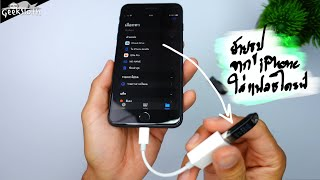</a>

---

## Contact and public channels

I am currently focused on PhD research, so replies may take longer than usual.

  
  &nbsp;&nbsp;
  
  &nbsp;&nbsp;
  
  &nbsp;&nbsp;
  
  &nbsp;&nbsp;
  
  &nbsp;&nbsp;
  

---

### A curiosity

If you are interested in visual perception and image interpretation, explore this project:

<a href="https://github.com/geeksloth/Who-is-the-child-in-this-image">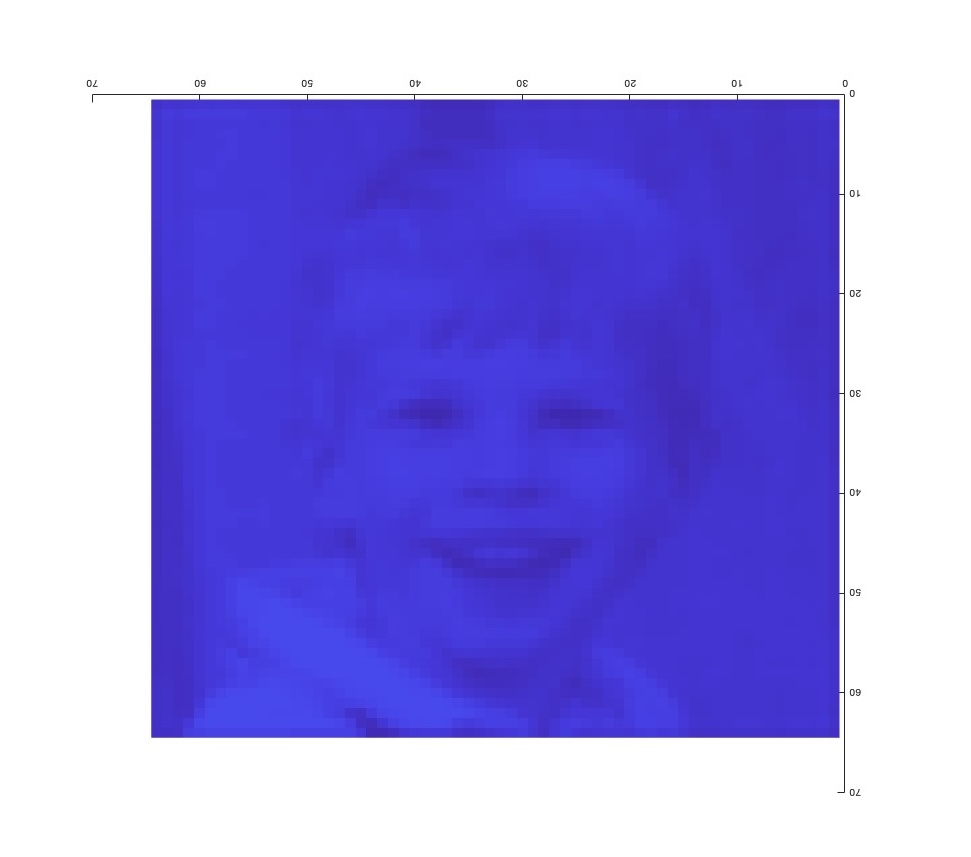</a>
